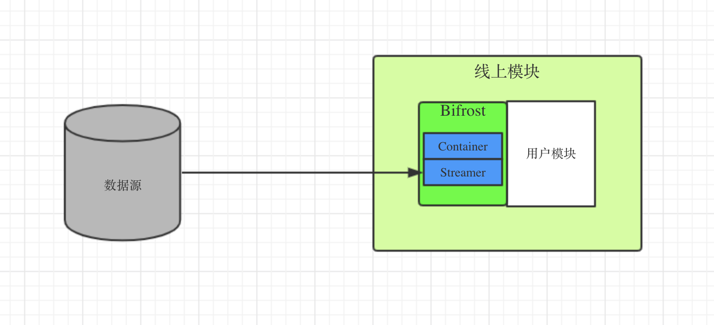
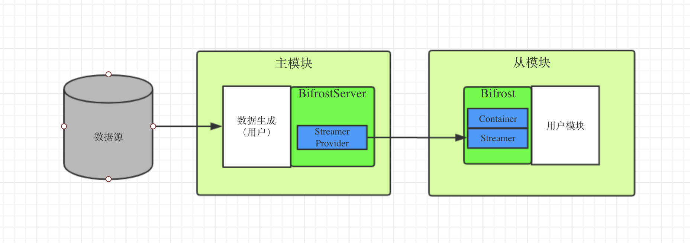
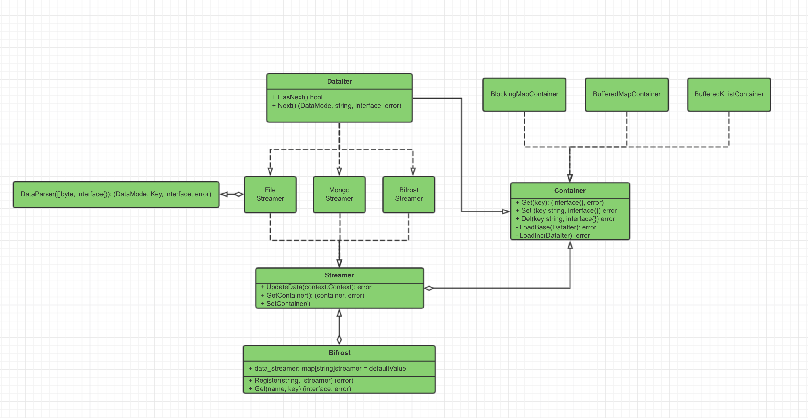

# Bifrost

Bifrost取自北欧神话中是连结阿斯加德（Asgard）和 米德加尔特（中庭/Midgard）的巨大彩虹桥，意即“摇晃的天国道路”。

在这里寓意“数据的传输道路”，它的功能是将远端的数据同步到本机内存中，是一个数据生产、传输、加载的工具。

* 数据转化：支持多种数据源，例如：本地文件、远程文件、mongo等。
* 数据传输：支持多种传输（文件、socket等）
* 数据加载：支持多种内存模型（分层k-v, 分层k-list），满足用户的不同需求

用户可以通过简单的配置，使用该工具将本地文件、数据库中的数据加载到内存中。也支持自定义数据源，满足复杂的数据依赖关系和业务需求。

Example:

``````go
// init
bifrost := bifrost.NewBifrost() // new a bifronst object

// Register streamer
s, _ := streamer.NewLocalFileStreamer(&streamer.FileStreamerCfg{
  Name:       "example1",
  Path:       "a.txt",
  Interval:   60,
  IsSync:     true,
  DataParser: &streamer.DefaultTextParser{},
})
c := &container.BufferedMapContainer{}  
s.SetContainer(c)
bifrost.Register("exmaple1", s)
_ = s.UpdateData(context.Background()) // 启动更新数据

// use
value, err := bifrost.Get("exmaple1", container.StrKey("key"))
value, err := bifrost.Get("exmaple1", container.Int64(1))
``````


# 架构设计

Bifrost分为两种模式

1. 直连模式  bifrost直接从数据源读取数据
2. 主从模式  bifrost从主节点同步数据

## 直连模式

简单的数据源可以使用直连模式，直接将数据加载到目标内存中



## 主从模式

复杂的数据源（数据源直接有依赖关系，或者业务逻辑比较复杂），可以使用主从模式。

用户自己生成数据，写到主服务中， 从Bifrost同步主服务中的数据



## Bifrost UML图



Bifrost有三个组件

1. Bifrost: 用户接口，
   1. 注册、管理、更新Streamer
   2. 提供数据查询接口
   3. 提供增量更新服务
2. Streamer
   1. 数据源的抽象
   2. 负责数据的更新，解析
   3. 生成全量、增量数据
3. Container
   1. 数据的容器
   2. 负责更新、维护内存中的数据
   3. 常见的数据结构， KV型，K-List型

## Container

container是一个接口，代表存放数据的容器，Bifrost有两种实现，KV型map，K-List型map

接口描述：

```go
const (
	DataModeAdd    DataMode = 0
	DataModeUpdate DataMode = 1
	DataModeDel    DataMode = 2
)

// 数据迭代器
type DataIterator interface {
	HasNext() bool
	Next() (DataMode, MapKey, interface{}, error)
}

// key of the map, because of go-lang not support generic type，
// So, here defined an interface for int value or string value key
type MapKey interface {
   PartitionKey() int64
   Value() interface{}
}

type Container interface {
   Get(MapKey) (interface{}, error)
   Set(MapKey, interface{}) error
   Del(MapKey, interface{}) error

   //全量更新
   LoadBase(DataIterator) error
   // 增量更新
   LoadInc(DataIterator) error
}
```

### BufferedMapContainer

1. 全量更新采用双buffer机制
2. 不支持增量更新

### BlockingMapContainer

1. 采用分桶加锁的方式实现多线程读写安全, 兼顾功能与效率
2. 数据初始化时全量更新一次，后续只有增量更新
3. 更新时遇到相同的key会覆盖写

``````go
// 创建一个BlockingMapContainer
bmc := container.NewBlockingMapContainer(bucket)
``````

### BufferedKListContainer

1. 更新时遇到相同的key会合并到同一个list中
2. 全量更新采用双Buffer机制
3. 不支持增量更新
4. 不会删除已更新的数据

# Streamer

streamer是一个数据源的接口，设计如下

```go
type DataParser interface {
  Parse([]byte, interface{}) (container.DataMode, container.MapKey, interface{}, error)
}

type DataStreamer interface {
   SetContainer(container.Container)
   GetContainer() container.Container
   // 更新数据接口
   UpdateData(ctx context.Context) error
   // 继承
   DataIterator
}
```

Streamer会绑定一个Container, UpdateData接口会监控数据源是否发生变化，则会调用响应的接口更新Container里的数据。 实现DataIterator接口，可以让DataStreamer像迭代器一样工作。

DataParser是一个数据解析的接口，需要用户自定义

### 数据更新模式

1. static 不更新
2. dynamic 动态全量更新
3. increase  全量更新一次，之后动态更定增量

streamer之前没有依赖关系，每个streamer维护自己的更新进度即可，不需要统一的模块维护

### 数据更新方式

1. sync 同步更新, 第一次全量更新使用同步的方式
2. async  异步更新， 第一次全量更新使用异步的方式

## LocalFileStreamer

FileStreamer代表本地文件文件

示例：

```go
s, _ := streamer.NewFileStreamer(&streamer.FileStreamerCfg{
   Name:       "example1",
   Path:       "a.txt",
   Interval:   60,
   IsSync:     true,
   DataParser: &streamer.DefaultTextParser{},
   UserData:   nil,
})
```

## MongoStreamer

MongoStreamer对应对应mongo数据里面的一张表。

1. 支持全量增量更新（需用户定义全量、增量的语句）
2. 全量增量的更新时间
3. 增量语句的更新

示例：

```go
ms := NewMongoStreamer(&MongoStreamerCfg{
   Name:        "mongo_test",
   UpdatMode:   Dynamic,
   IncInterval: 60,
   IsSync:      true,
   IP:          "127.0.0.1",
   Port:        21017,
   BaseParser:  &DefaultTextParser{},
   IncParser:   &DefaultTextParser{},
   BaseQuery:   "mongo base query",
   IncQuery:    "mongo inc query",
   UserData:    "user defined data",
   OnIncFinish: func(userData interface{}) interface{} {
      return "nfew inc base query"
   },
})
```

## BifrostStreamer

自定义数据流，支持数据的全量增量的生成、和加载，分BifrostStreamer和StreamerServer两个部分。 

StreamerServer：是一个可以管理多个StreamerProvider的服务，给BifrostStreamer提供基准，增量数据

StreamerProvider： 提供全量、增量更新接口，可生成基准、增量数据，一个StreamerProvider对应一个Streamer。

BifrostStreamer：Bifrost会根据streamer的名字，去对应的地址拉取全量或增量数据，同时更新到container中。


### StreamerServer

StreamerServer有两部分：

1. RPC服务: 同步主从之间的数据，使用rpcx框架；
2. StreamerProvider: 

#### 基准、增量生成规则：

1. 定期dump基准文件，更新时间
2. 实时写增量文件，内容包含streamerName，更新时间，更新内容

离线模块与线上模块交互：

1. 基准采用文件方式， 文件格式使用Gob序列化方式， 也可以使用

   ``````go
   type BaseInfo struct {
   	Name        string
   	UpdateTime  int64
   	DataVersion int
   	Data        map[container.MapKey]interface{}
   }
   ``````

2. 增量采用socket方式， 使用rpc框架

   接口设计

   ```go
   type BaseReq struct {
   	Name     string
   	Space    string
   	Progress int64
   }
   type IncRecord struct {
   	DataMode container.DataMode
   	MapKey   container.MapKey
   	Progress int64 // 更新时间
   	Value    interface{}
   }
   type Response struct {
     Records []Record
   }
   ```

   增量既可以存放在内存中，也可以dump到磁盘中

3. 示例

   ``````go
   	bs := NewBiFrostStreamer(&BiFrostStreamerCfg{
   		Name:         "BiFrostStreamer",
   		Version:      0,
   		Ip:           "",
   		Port:         1111,
   		BaseFilePath: "",
   		Interval:     60,
   		IsSync:       true,
   		IsOnline:     false,
       WriteFile:    false,
       CacheSize:    10000,
   	})
   ``````


### Streamer与Container的关系

Streamer代表数据源，Container则代表数据的内存组织方式。

通常情况下Streamer跟Container是一对一的关系，特殊情况下也会出现一对多或者多对一的关系

- 一对一：
- 多对一：索引的基准、增量来自不同的数据源

# For开发者

Bifrost提供比较基础的container和streamer, 如不满足需要，可以自行开发，只要遵循支持设计接口即可


# TODO:

