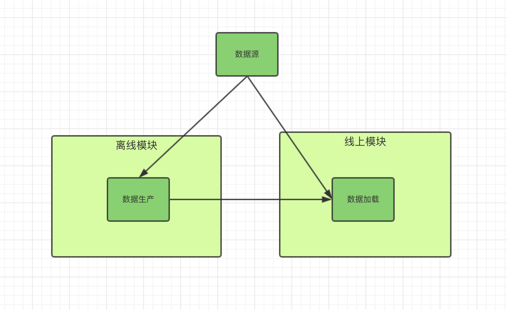
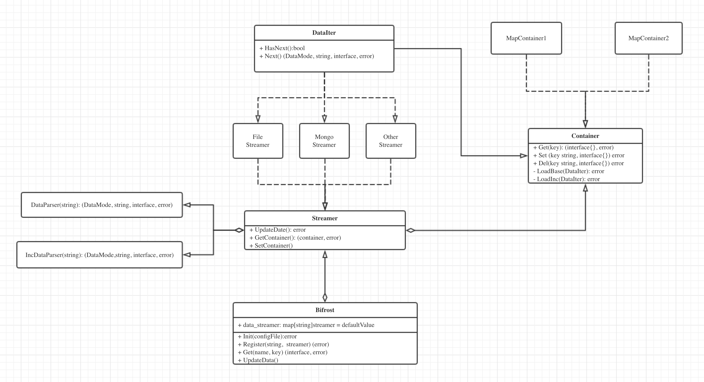

# Bifrost

Bifrost取自北欧神话中是连结阿斯加德（Asgard）和 米德加尔特（中庭/Midgard）的巨大彩虹桥，意即“摇晃的天国道路”。

在这里寓意“数据的传输道路”，它的功能是将远端的数据同步到本机内存中，是一个数据生产、传输、加载的工具。

* 数据生产：支持多种数据源，例如：本地文件、远程文件、mongo等。
* 数据传输：支持多种传输（文件、socket等）
* 数据加载：支持多种内存模型（分层k-v, 分层k-list），满足用户的不同需求

# 架构设计




Bifronst有两大组件， Container和Streamer

Container是内存中相同数据集的抽象，主要是Key-Value， Key-List结构

Streamer是数据源与Container之间的同步者

一个完整的服务包含离线模块和线上模块

线上模块既可以从数据源中读数据，也可以离线模块读取数据。

离线模块负责复杂逻辑的数据生产，基准、增量的生成，与线上模块的同步工作

### 离线模块基准、增量生成规则：

1. 定期dump基准文件、增量文件的序号，更新时间
2. 实时写增量文件，内容包含streamerName, 需要，更新时间，更新内容

离线模块与线上模块交互：

1. 基准采用文件方式

2. 增量采用socket方式， 使用rpcx框架

   接口设计

   ```go
   type Request struct {
     name string // streamer name
     prograss int // 同步进度
   }
   type Record struct {
     DataType int // 0 新增， 1 更新  2 删除
     MapKey []MapKey
     Value interface
   }
   type Response struct {
     Records []Record
   }
   ```

## UML设计



设计上主要分为三个组件
1. Bifrost: 用户接口，
   1. 注册、管理、更新Streamer
   2. 提供数据查询接口
   3. 提供增量更新服务
2. Streamer
   1. 数据源的抽象
   2. 负责数据的更新，解析
   3. 生成全量、增量数据
3. Container
   1. 数据的容器
   2. 负责更新、维护内存中的数据

## Streamer与Container的关系

Streamer代表数据源，Container则代表数据的内存组织方式。

通常情况下Streamer跟Container是一对一的关系，特殊情况下也会出现一对多或者多对一的关系

- 一对一：
- 一对多：DirStreamer
- 多对一：索引，基准增量来自不同的数据源

## Streamer数据更新

### 数据更新模式

1. static 不更新
2. dynamic 动态全量更新
3. increase  全量更新一次，之后动态更定增量
4. dynInc 定时全量更细，动态增量更新

### 数据更新方式

1. sync 同步更新
2. async  异步更新

### Streamer之间的关系

由于离线模块可以处理复杂的数据依赖关系，所以Streamer之间不需要依赖关系

### Streamer更新流程

Streamer没有依赖关系，各个Streamer自行更新

~~Streamer根据数据源的不同会分为主动更新和被动更新~~

~~主动更新会实时监控数据源变化，发现变化会自动触发更新，不需要Bifrost调度模块管理~~

~~被动更新会定期的触发更新，由Bifrost调度模块统一管理~~

~~对于同一个Streamer，若上次更新未完成，可根据用户配置决定是否终止上次更新~~

~~数据更新失败用户可自定义错误处理函数~~

~~Bifrost调度模块采用邮件队列~~

## FileStreamer

FileStreamer代表本地文件文件

1. 全量更新
2. 增量更新 (一期暂不支持)
3. 绑定Parser
4. 错误处理
   1. 回调方式（）
   2. 打日志
   3. 出现错误是否终止本次更新（用户可配置）
5. 采用主动更新的方式

## DirStreamer

DirStreamer代表一个目录，是一个虚拟的Streamer，本身不会关联container, 需要跟File联合使用，当发现新文件时，会创建FileStreamer,然后注册到Bifrost,当文件被删除时，会注销对应的Streamer

1. Patten  文件名满足patten的才会创建streamer， 如不设置，加载所有文件
2. GetParser(string) DataParser  根据文件名获取parser， 如返回DataParser为空，Streamer创建失败
3. GetName(string) string   根据文件名获取streamer名字，如不设置就是文件名

## MongoStreamer

MongoStreamer对应对应mongo数据里面的一张表。

1. 支持全量增量（需用户定义全量、增量的语句）
2. 全量增量的更新时间
3. 增量语句的更新

Example

## BifrostStreamer（支持）

自定义数据流，支持数据的全量增量的生成、和加载