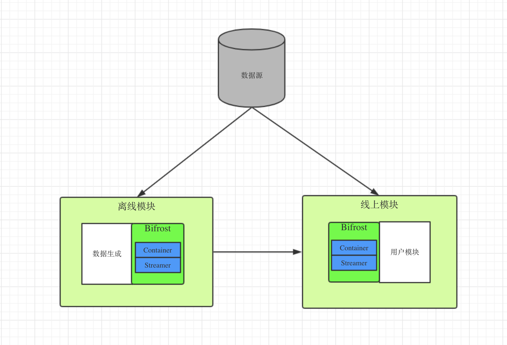

# Bifrost

Bifrost取自北欧神话中是连结阿斯加德（Asgard）和 米德加尔特（中庭/Midgard）的巨大彩虹桥，意即“摇晃的天国道路”。

在这里寓意“数据的传输道路”，它的功能是将远端的数据同步到本机内存中，是一个数据生产、传输、加载的工具。

* 数据生产：支持多种数据源，例如：本地文件、远程文件、mongo等。
* 数据传输：支持多种传输（文件、socket等）
* 数据加载：支持多种内存模型（分层k-v, 分层k-list），满足用户的不同需求

用户可以通过简单的配置，使用该工具将本地文件、数据库中的数据加载到内存中。也支持自定义数据源，满足复杂的数据依赖关系和业务需求。

# 架构设计



架构如上图，主要分为三个模块，数据源，线上模块，离线模块

对于简单的数据，线上模块可以直接使用Bifrost功能读取数据源中的数据

对于复杂的数据，需要离线模块，由用户自定义数据生成的方式，然后通过Bifrost工具生成数据流，线上的Bifrost直接读取线下Bifrost产生的数据。

## Bifrost UML图


Bifrost有三个组件

1. Bifrost: 用户接口，
   1. 注册、管理、更新Streamer
   2. 提供数据查询接口
   3. 提供增量更新服务
2. Streamer
   1. 数据源的抽象
   2. 负责数据的更新，解析
   3. 生成全量、增量数据
3. Container
   1. 数据的容器
   2. 负责更新、维护内存中的数据
   3. 常见的数据结构， KV型，K-List型

## Container

container是一个接口，代表存放数据的容器，Bifrost有两种实现，KV型map，K-List型map

接口描述：

```go
const (
	DataModeAdd    DataMode = 0
	DataModeUpdate DataMode = 1
	DataModeDel    DataMode = 2
)

// 数据迭代器
type DataIterator interface {
	HasNext() bool
	Next() (DataMode, MapKey, interface{})
}

// key of the map, because of go-lang not support generic type，
// So, here defined an interface for int value or string value key
type MapKey interface {
   PartitionKey() int64
   Value() interface{}
}

type Container interface {
   Get(key MapKey) (interface{}, error)
   // 如果key相同， 会覆盖写
   Set(key MapKey, value interface{}) error
   Del(key MapKey, value interface{}) error

   //全量更新
   LoadBase(dataIter DataIterator) error
   // 增量更新
   LoadInc(dataIter DataIterator) error
}
```

### KvMapContainer

1. 全量更新采用双buffer机制
2. 采用分桶加锁的方式实现多线程读写安全
3. 增量更新遇到相同的key，最新的数据生效

### KListMapContainer

1. 全量更新采用双Buffer机制
2. 采用分桶加锁的方式实现多线程读写安全
3. 更新时遇到相同的key会合并到同一个list中
4. 删除时只会删除key,value都相等的字段

# Streamer

streamer是一个数据源的接口，设计如下

```go
type DataParser interface {
	Parse([]byte) (container.DataMode, container.MapKey, interface{}, error)
}

type DataStreamer interface {
   SetContainer(container.Container)
   GetContainer() container.Container
   // 更新数据接口
   UpdateData(ctx context.Context) error
   // 继承
   DataIterator
}
```

Streamer会绑定一个Container, UpdateData接口会监控数据源是否发生变化，则会调用响应的接口更新Container里的数据。 实现DataIterator接口，可以让DataStreamer像迭代器一样工作。

DataParser是一个数据解析的接口，需要用户自定义

### 数据更新模式

1. static 不更新
2. dynamic 动态全量更新
3. increase  全量更新一次，之后动态更定增量
4. dynInc 定时全量更细，动态增量更新

streamer之前没有依赖关系，每个streamer维护自己的更新进度即可，不需要统一的模块维护

### 数据更新方式

1. sync 同步更新
2. async  异步更新

## LocalFileStreamer

FileStreamer代表本地文件文件

1. 全量更新
2. 增量更新 (一期暂不支持)
3. 绑定Parser
4. 错误处理
   1. 回调方式（）
   2. 打日志
   3. 出现错误是否终止本次更新（用户可配置）
5. 采用主动更新的方式

## MongoStreamer

MongoStreamer对应对应mongo数据里面的一张表。

1. 支持全量增量（需用户定义全量、增量的语句）
2. 全量增量的更新时间
3. 增量语句的更新

## BifrostStreamer

自定义数据流，支持数据的全量增量的生成、和加载，分离线和在线两种工作模式。 

离线模式：由用户产生数据（可同时产生多个streamer），并写入BifrostStreamer, BifrostStreamer会将数据写入container并将按要求产生基准、增量数据。一个离线模块可以看做是一个微服务

在线模式：Bifrost会根据streamer的名字，去对应的地址拉取全量或增量数据，同时更新到container中。

### 离线模块基准、增量生成规则：

1. 定期dump基准文件、增量文件的序号，更新时间
2. 实时写增量文件，内容包含streamerName, 需要，更新时间，更新内容

离线模块与线上模块交互：

1. 基准采用文件方式

2. 增量采用socket方式， 使用rpcx框架

   接口设计

   ```go
   type Request struct {
     Name string // streamer name
     Timestamp int // 更新时间
   }
   type Record struct {
     DataType int // 0 新增， 1 更新  2 删除
     Timestamp int
     MapKey []MapKey
     Value interface
   }
   type Response struct {
     Records []Record
   }
   ```

### Streamer与Container的关系

Streamer代表数据源，Container则代表数据的内存组织方式。

通常情况下Streamer跟Container是一对一的关系，特殊情况下也会出现一对多或者多对一的关系

- 一对一：
- 多对一：索引的基准、增量来自不同的数据源

# For开发者

Bifrost提供比较基础的container和streamer, 如不满足需要，可以自行开发，只要遵循支持设计接口即可