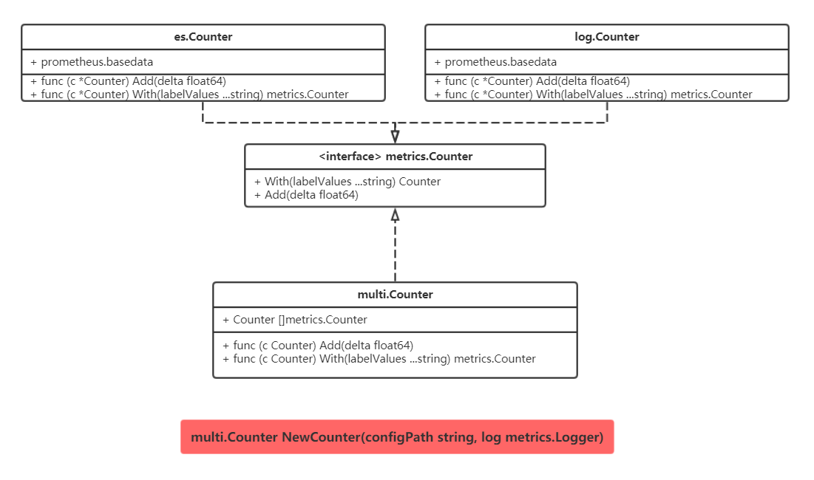

# metrics

metrics为监控服务提供了统一的调用接口,主要包括counter,gauge,summary.而且为一些流行的metrics服务提供了适配器.

## usage

```golang 
//path: /project/conf/config
es : true //开关设定
log : false
prometheus: true

esConfig:
    Host: xxxx
    Port: xxxx
    DocId: xxxx
    DocType: xxxx
    Interval: 10s
    Lables:
        httpCode
        httpMethod

logConfig:
    Lables:
        httpCode

prometheusConfig:
    Namespace: xxx
    Subsystemp: xxxx
    Help: xxxx
    Name: xxxx
    Lables:
        httpCode
        httpMethod
```

```golang 
//use
func main() {
    var multiCount multi.Counter
    multiCount = multi.NewCounter("/project/conf/config")
    multiCount.Add(1)
}

```

## 设计图

### Counter

### Gauge

### Summary


