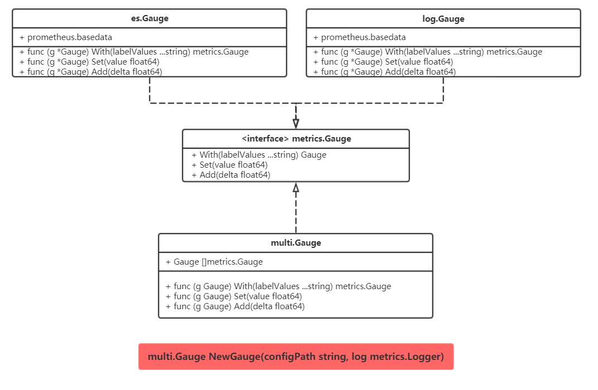
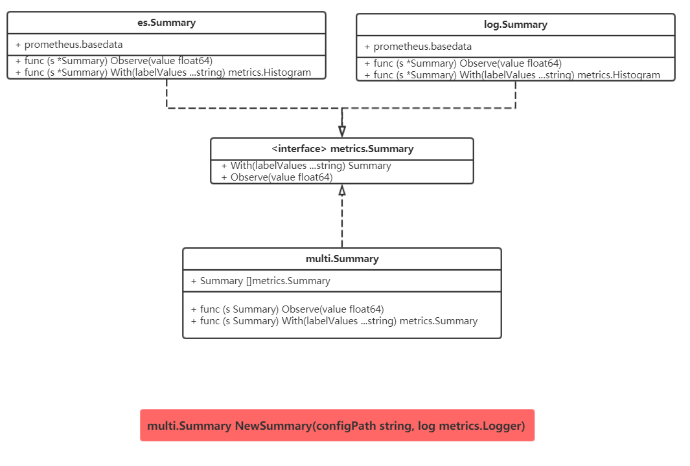

# metrics

metrics为监控服务提供了统一的调用接口,主要包括counter,gauge,summary.而且为一些流行的metrics服务提供了适配器.

## usage

install:
```
cd $GOPATH/src/github.com
go get -v -u github.com/prometheus/client_golang/prometheus
go clone https://github.com/Schneizelw/elasticsearch.git 
go clone https://github.com/Schneizelw/mtggokit.git


```


```golang 
#path: /project/conf/config.yaml
open:
    es: true //开关设定
    log: false
    prometheus: true

monitorSystem:
    default:
        Namespace: "counter_test"
        Subsystemp: "test1"
        Help: "http request"
        Name: "request"
    es:
        Host: "xxxx"
        Port: "xxxx"
        Index: "metric_test"
        Type: "test"
        Interval: 10
# 配置summary的误差值, Quantile50表示二分位.
Metrics:
    Summary:
        Quantile50: 5
        Quantile90: 2
        Quantile99: 1

```

```

```golang 
//use
import (
    "log"
)
func main() {
    var logger *log.Logger
    var multiCount multi.Counter
    lables := []string{"httpCode", "httpMethod"}
    multiCount = multi.NewCounter("/project/conf/config.yaml", lables)
    multiCount.with({"httpCode":"200","httpMethod":"POST"}).Add(1)
    multiCount.with({"httpCode":"200","httpMethod":"GET"}).Add(2)
    multiCount.with({"httpCode":"200","httpMethod":"POST"}).Add(3)
}
```

## 总体框架


## 设计图

### Counter

### Gauge

### Summary



